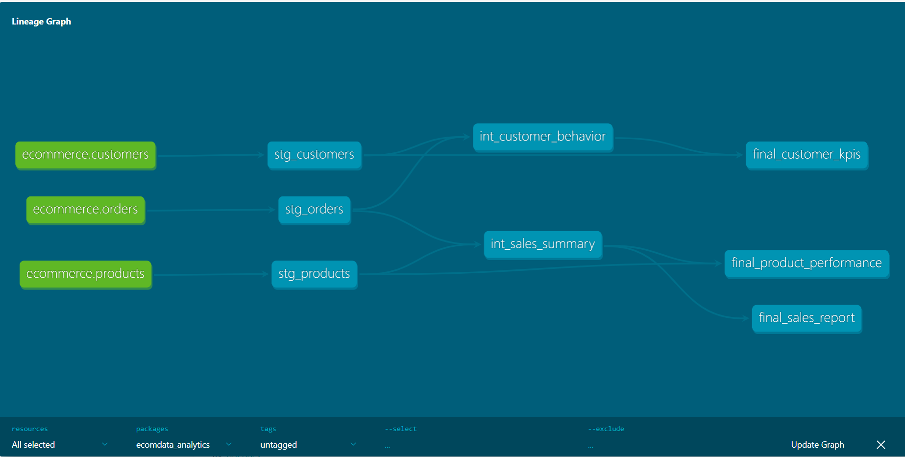

# EcomData Insights

## 1. Introduction and Project Context

**Project Name**: **EcomData Insights**

**Context**:  
The **EcomData Insights** project aims to model and analyze data from a fictional e-commerce platform. The goal is to transform raw data into actionable insights to help make informed decisions about sales performance and customer behavior.

**Objectives**:
- Clean and transform raw CSV data into analysis-ready information.
- Calculate **Key Performance Indicators (KPIs)** related to products, sales, and customer behavior.

**Technologies Used**:
- **dbt** for data transformations.
- **PostgreSQL** as a data warehouse.
- **Docker** for managing the local environment.

---

## 2. Project Architecture

**Architecture Diagram**:

- **Source Data** (CSV files)
- **dbt** for transformations (staging, intermediate, and final models)
- **PostgreSQL** as the data warehouse

**Architecture Overview**:
- The source data is generated via Python scripts and imported into PostgreSQL from CSV files.
- **dbt** is used to transform the data in three stages (staging, intermediate, and final).
- PostgreSQL serves as the data warehouse to store the transformation results.

---

## 3. Data Details

**Dataset Description**:
- **Customers**: Data about customers (ID, name, email, country).
- **Products**: Data about products (ID, name, category, price).
- **Orders**: Data about orders (order ID, customer ID, product ID, quantity, total price, order date).

**Data Generation Process**:
- The data is artificially generated using a Python script with the **Faker** library to simulate a realistic e-commerce scenario.

**Importing into PostgreSQL**:
- The generated CSV files are loaded into PostgreSQL using the `COPY` SQL command.

---

## 4. Transformation Pipeline with dbt

**dbt Model Structure**:
1. **Staging Models**: Clean the raw data to prepare it for further transformations (e.g., `stg_customers`, `stg_products`, `stg_orders`).
2. **Intermediate Models**: Perform aggregations and advanced calculations on the cleaned data (e.g., `int_sales_summary`, `int_customer_behavior`).
3. **Final Models**: Generate ready-to-use reports for analysis (e.g., `final_sales_report`, `final_product_performance`).

**Example Transformation**:

In **`final_product_performance.sql`**, total sales and the number of orders per product are calculated:

```sql
WITH product_performance AS (
    SELECT
        product_id,
        SUM(total_sales) AS total_revenue,
        SUM(total_orders) AS total_orders
    FROM {{ ref('int_sales_summary') }}
    GROUP BY product_id
)
SELECT
    p.product_id,
    p.product_name,
    p.category,
    pp.total_revenue,
    pp.total_orders
FROM {{ ref('stg_products') }} p
JOIN product_performance pp
ON p.product_id = pp.product_id
ORDER BY pp.total_revenue DESC;
```


## 5. Conclusion and Future Prospects

### Final Results:
- Using the dbt transformation pipelines, the raw data is cleaned, transformed, and ready for in-depth analysis.
- The final models generate reports on sales, product performance, and customer behavior.

### Future Prospects:
- **Automation**: Integrating an orchestrator like **Airflow** or **Prefect** would be a valuable next step to schedule and automate dbt pipeline executions.
- **Data Visualization**: Using a data visualization tool like **Metabase** or **Superset** would enable the creation of interactive dashboards based on the final models.
