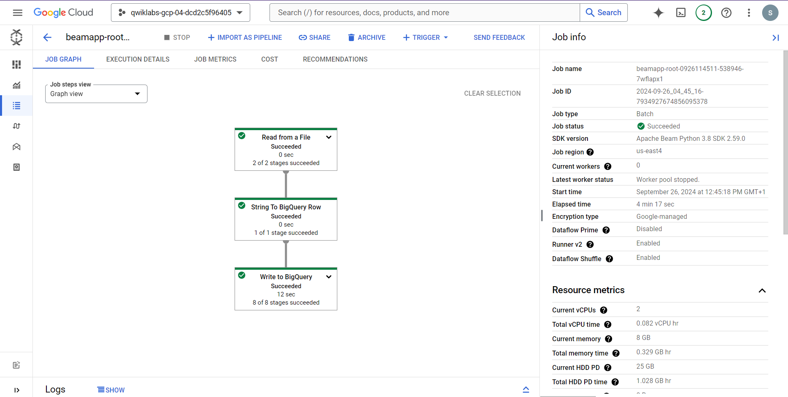
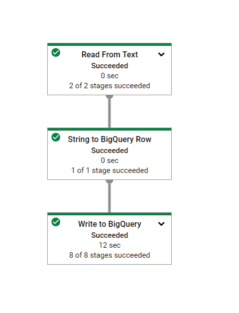
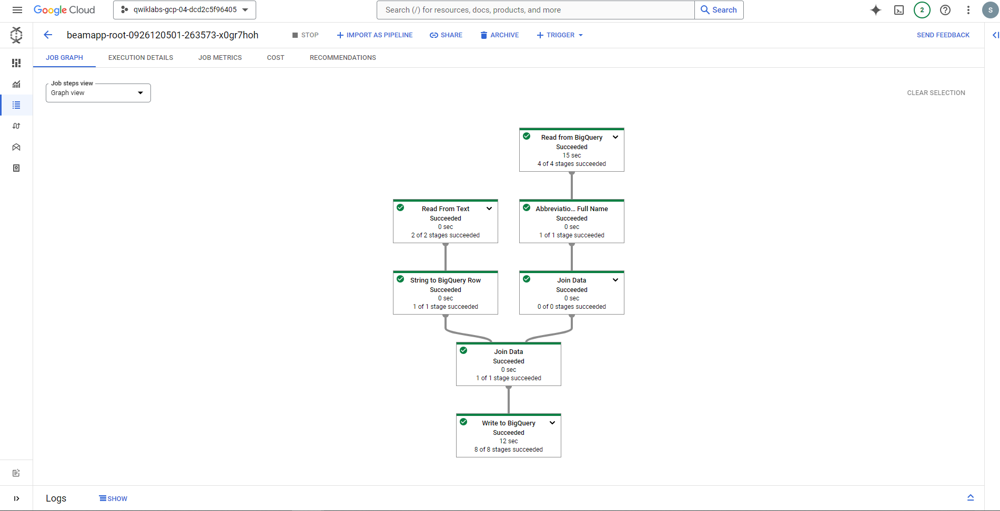
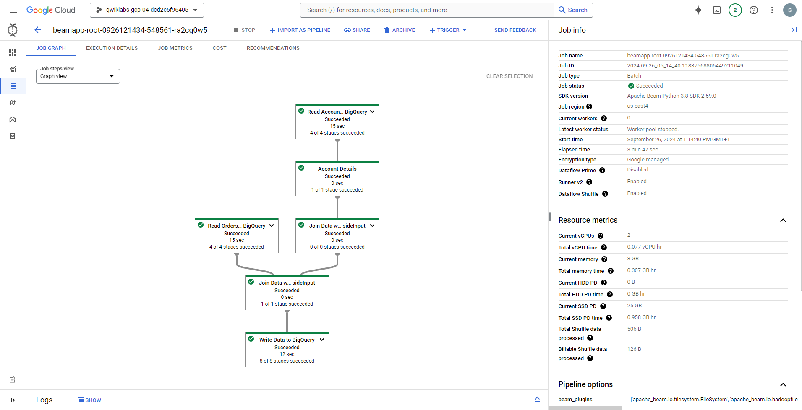
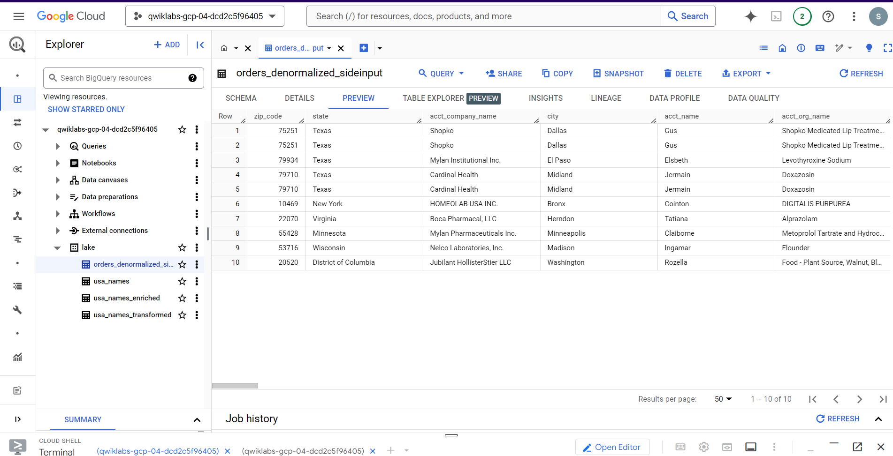

# ETL Pipeline on Google Cloud: Dataflow and BigQuery

## Project Overview

This project demonstrates an ETL (Extract, Transform, Load) pipeline built on **Google Cloud**. It processes large datasets by ingesting CSV files from **Cloud Storage**, transforming the data using **Dataflow** with Apache Beam (Python), and loading the transformed data into **BigQuery** for analysis.

## Objectives

- **Ingest** CSV data from Google Cloud Storage.
- **Transform** data (filter headers, format dates, etc.) using Apache Beam.
- **Load** the processed data into BigQuery.
- **Enrich** data by joining multiple datasets in BigQuery and creating denormalized tables.

## Technology Stack

- **Google Cloud Platform**:
  - **Cloud Storage**: Store raw data files.
  - **Dataflow**: For ETL processing using Apache Beam.
  - **BigQuery**: Store and analyze processed data.
- **Python**: Used to build Dataflow pipelines.
- **Apache Beam**: Framework for batch and stream processing.

## Features

1. **Data Ingestion**:
   - Read CSV files from Cloud Storage.
   - Remove headers and convert lines into dictionary objects.

   

2. **Data Transformation**:
   - Format dates and clean data for BigQuery compatibility.
   
   

3. **Data Loading**:
   - Load the cleaned data into BigQuery for querying and analysis.
   
   

4. **Data Enrichment**:
   - Join multiple datasets in BigQuery and create a denormalized data mart.

   

5. **Result:**

    

## Project Structure

- `data_ingestion.py`: Ingest CSV data from Cloud Storage and load it into BigQuery.
- `data_transformation.py`: Perform transformations like date formatting.
- `data_enrichment.py`: Join datasets to create an enriched dataset.
- `data_lake_to_mart.py`: Move data from a data lake to a data mart using joins.

3. **Future Enhancements :**
    - Add data validation before loading into BigQuery.
    - Automate pipeline execution using Google Cloud Functions.
    - Visualize data using Google Data Studio.
    
## Acknowledgment

This project is originally part of the Google Cloud Skills Boost platform, specifically from the lab "ETL Processing on Google Cloud Using Dataflow and BigQuery (Python)." I have adapted and re-implemented it to showcase my skills and understanding of cloud-based ETL pipelines. All the original concepts, materials, and instructions are provided by Google Cloud Skills Boost, and this adaptation is for educational and portfolio purposes.