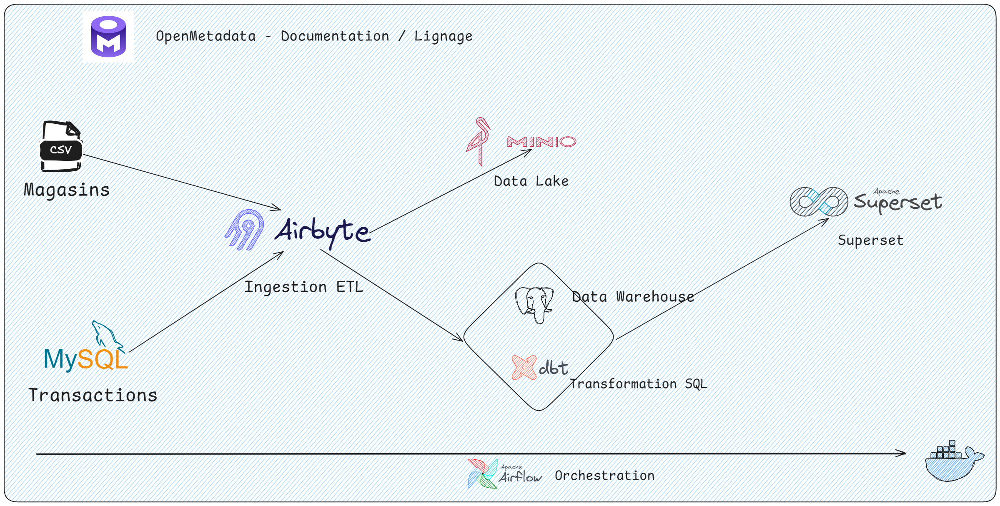

# 📚 **README.md — Projet RetailFlow : Stack Data Engineering**

## 🚀 **1. Introduction**

**RetailFlow** est un projet de **Data Engineering complet** conçu pour simuler le traitement, l'intégration, la transformation, et l'analyse de données dans le secteur du **retail (commerce de détail)**. Ce projet illustre comment collecter, centraliser et analyser des données transactionnelles et des fichiers externes (CSV) à l'aide d'une stack moderne de **Data Engineering open-source**, déployée localement avec **Docker**.

### 🎯 **Objectif du Projet :**
1. **Intégrer des données transactionnelles MySQL** (données clients, produits, commandes).  
2. **Importer des données externes via un fichier CSV** (localisation des magasins).  
3. **Stocker les données dans un Data Warehouse (PostgreSQL)**.  
4. **Orchestrer les flux de données avec Airflow**.  
5. **Transformer et modéliser les données avec dbt**.  
6. **Visualiser les insights avec Apache Superset**.  
7. **Documenter et gouverner les données avec OpenMetadata**.

---

## 🏢 **2. Contexte Métier : Cas d'Usage Retail**



### 📊 **Scénario : Vente en ligne et magasins physiques**
Une chaîne de magasins de détail opérant à la fois en ligne et en physique souhaite mieux comprendre ses ventes, ses clients et ses magasins. Pour cela, elle a besoin de :

- **Données transactionnelles (MySQL)** : Commandes clients en ligne (produits achetés, montants, date).  
- **Données externes (CSV)** : Informations géographiques sur les magasins physiques (ville, région, pays).  
- **Centralisation dans un entrepôt de données (PostgreSQL)** pour analyse et reporting.  
- **Transformations analytiques (dbt)** : Modélisation des ventes par client, produit, et localisation.  
- **Orchestration (Airflow)** : Automatisation des workflows ETL/ELT.  
- **Visualisation (Superset)** : Tableaux de bord interactifs sur les ventes et performances.  
- **Gouvernance (OpenMetadata)** : Documentation, lignage des données, gouvernance.

---

## 🛠️ **3. Architecture Technique**

L'architecture de RetailFlow repose sur une approche **modulaire et évolutive** :

## 📌 **4. Détails des Composants :**
1. MySQL (Base de données transactionnelle)
    - Stocke les transactions clients, produits et commandes.

2. Fichier CSV (Localisation des magasins)
    - Fichier externe stocké localement.

3. Airbyte (Ingestion de données)
    - Collecte les données depuis MySQL et le fichier CSV.
    - Envoie les données vers MinIO (Data Lake) et PostgreSQL (Data Warehouse).

4. MinIO (Stockage Objet)
    - Stockage de fichiers bruts et formatés pour les traitements futurs.
    
5. PostgreSQL (Data Warehouse)
    - Stocke les données modélisées pour les requêtes analytiques.

6. dbt (Transformation)
    -  Transforme les données en modèles analytiques (vue agrégée des ventes, clients, etc.).

7. Airflow (Orchestration)
    - Automatisation de la collecte (Airbyte), transformation (dbt) et mise à jour des tableaux de bord.

8. OpenMetadata (Gouvernance)
    - Assure la traçabilité et la documentation des pipelines de données.

9. Superset (Visualisation)
    - Crée des tableaux de bord interactifs pour explorer les ventes, les clients et les magasins.

## 🎓 4. **Étapes Clés du Pipeline de Données**
1. Ingestion avec Airbyte :
    - Synchronisation régulière des données depuis MySQL et le fichier CSV vers PostgreSQL et MinIO.

2. Stockage :
    - Les données sont centralisées dans PostgreSQL pour des analyses structurées.
    - Les fichiers bruts sont stockés dans MinIO.

3. Transformation avec dbt :
    - Agrégation des ventes par client, produit et localisation.
    - Nettoyage et structuration des données.

4. Orchestration avec Airflow :
    - Automatisation de la collecte (Airbyte), transformation (dbt) et mise à jour des tableaux de bord.

5. Gouvernance avec OpenMetadata :
    - Documentation automatisée des schémas et tables.
    - Lignage des données.

6. Visualisation avec Superset :
    - Création de tableaux de bord pour analyser :
    - Les produits les plus vendus.
    - Les clients les plus rentables.
    - La performance des magasins par région.

## 📝 5. **Configuration du Projet**
### 🛠️ Prérequis :
- Docker & Docker Compose installés localement.
- Python 3.x pour les scripts de génération de données.
### 📥 **Installation :**
```bash
    git clone https://github.com/username/retail-flow-project.git
    cd retail-flow-project

    # Étape 1
    cd step1-mysql
    docker-compose up -d
    python data_generator.py

    # Étape 2
    cd step2-data-engineering
    docker-compose up -d
```

## 📊 6. **Tableaux de Bord Attendues**
- Performance des ventes par région.
- Top 10 des clients avec les plus gros achats.
- Produits les plus vendus.

## 🔗 7. **Ressources Utiles**
- Airbyte Documentation: https://docs.airbyte.com
- dbt Documentation: https://docs.getdbt.com
- Apache Superset: https://superset.apache.org


## 8. Arbo
```plaintext
retail-flow-project/
│
├─ step1-mysql/
│  ├─ docker-compose.yml
│  ├─ init-db.sql
│  ├─ data_generator.py
│  └─ README.md
│
│─step2-data-engineering/
|     │
|     ├── docker-compose.yml          # Docker Compose pour Airbyte, MinIO, PostgreSQL, dbt, Airflow, Superset, OpenMetadata
|     ├── .env                        # Fichier des variables d'environnement (mots de passe, configurations)
|     ├── README.md                   # Documentation de l'étape 2
|     │
|     ├── airbyte/                    # Configuration spécifique à Airbyte
|     │   ├── connections/            # Configuration des connexions Airbyte
|     │   │   ├── mysql_to_postgres.json
|     │   │   ├── csv_to_minio.json
|     │   ├── docker-entrypoint.sh    # Script d'initialisation
|     │   └── airbyte-config.yml      # Configuration globale d'Airbyte
|     │
|     ├── minio/                      # Configuration MinIO
|     │   ├── data/                   # Stockage des fichiers bruts CSV (Data Lake)
|     │   ├── config.json             # Configuration MinIO
|     │   └── docker-entrypoint.sh    # Script d'initialisation
|     │
|     ├── postgres/                   # Configuration PostgreSQL (Data Warehouse)
|     │   ├── init-scripts/           # Scripts d'initialisation PostgreSQL
|     │   │   ├── init.sql
|     │   └── docker-entrypoint.sh    # Script de démarrage
|     │
|     ├── dbt/                        # Projet dbt (Transformation SQL)
|     │   ├── dbt_project.yml         # Configuration principale dbt
|     │   ├── profiles.yml            # Configuration des connexions dbt
|     │   ├── models/                 # Modèles SQL
|     │   │   ├── staging/            # Modèles de staging
|     │   │   │   ├── stg_clients.sql
|     │   │   │   ├── stg_produits.sql
|     │   │   │   ├── stg_commandes.sql
|     │   │   ├── marts/              # Modèles analytiques
|     │   │   │   ├── mart_sales_summary.sql
|     │   │   │   ├── mart_top_customers.sql
|     │   │   ├── macros/             # Macros SQL personnalisées
|     │   │   ├── tests/              # Tests de qualité des données
|     │   ├── logs/                   # Logs des exécutions dbt
|     │   ├── target/                 # Résultats compilés de dbt
|     │   └── README.md
|     │
|     ├── airflow/                    # Configuration Airflow (Orchestration)
|     │   ├── dags/                   # DAGs Airflow
|     │   │   ├── retail_pipeline_dag.py
|     │   │   ├── airbyte_ingestion_dag.py
|     │   │   ├── dbt_transformation_dag.py
|     │   ├── plugins/                # Plugins personnalisés pour Airflow
|     │   ├── airflow.cfg             # Fichier de configuration d'Airflow
|     │   ├── docker-entrypoint.sh    # Script de démarrage Airflow
|     │   ├── logs/                   # Logs d'exécution des DAGs
|     │   └── README.md
|     │
|     ├── superset/                   # Configuration Superset (Visualisation)
|     │   ├── docker-entrypoint.sh    # Script de démarrage
|     │   ├── superset_config.py      # Configuration principale Superset
|     │   ├── dashboards/             # Fichiers JSON pour les tableaux de bord
|     │   │   ├── sales_dashboard.json
|     │   │   ├── product_performance.json
|     │   ├── datasets/               # Datasets Superset
|     │   ├── logs/                   # Logs Superset
|     │   └── README.md
|     │
|     ├── openmetadata/               # Configuration OpenMetadata (Gouvernance)
|     │   ├── docker-entrypoint.sh    # Script de démarrage
|     │   ├── openmetadata_config.yml # Configuration principale
|     │   ├── ingestion/              # Pipelines d'ingestion des métadonnées
|     │   │   ├── mysql_metadata.yml
|     │   │   ├── postgres_metadata.yml
|     │   │   ├── superset_metadata.yml
|     │   ├── logs/                   # Logs OpenMetadata
|     │   └── README.md
|     │
|     ├── scripts/                    # Scripts utilitaires
|     │   ├── reset_pipeline.sh       # Script pour réinitialiser les pipelines
|     │   ├── health_check.sh         # Script pour vérifier l'état des services
|     │   ├── load_csv_to_minio.sh    # Script pour charger les fichiers CSV dans MinIO
|     │   └── README.md
|     │
|     └── logs/                       # Logs généraux
|         ├── airbyte.log
|         ├── airflow.log
|         ├── dbt.log
|         ├── superset.log
|         ├── openmetadata.log
|         └── general.log
|   
├─ data/
│  └─ store_locations.csv
│
└─ README.md
```